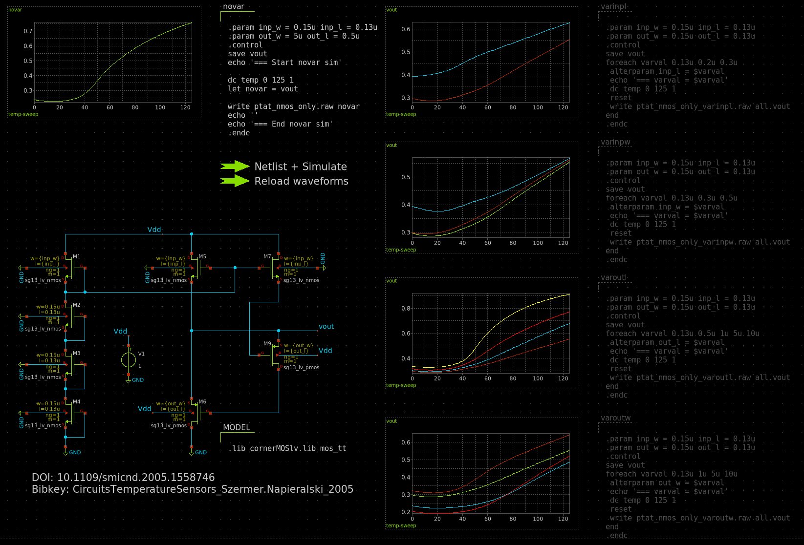
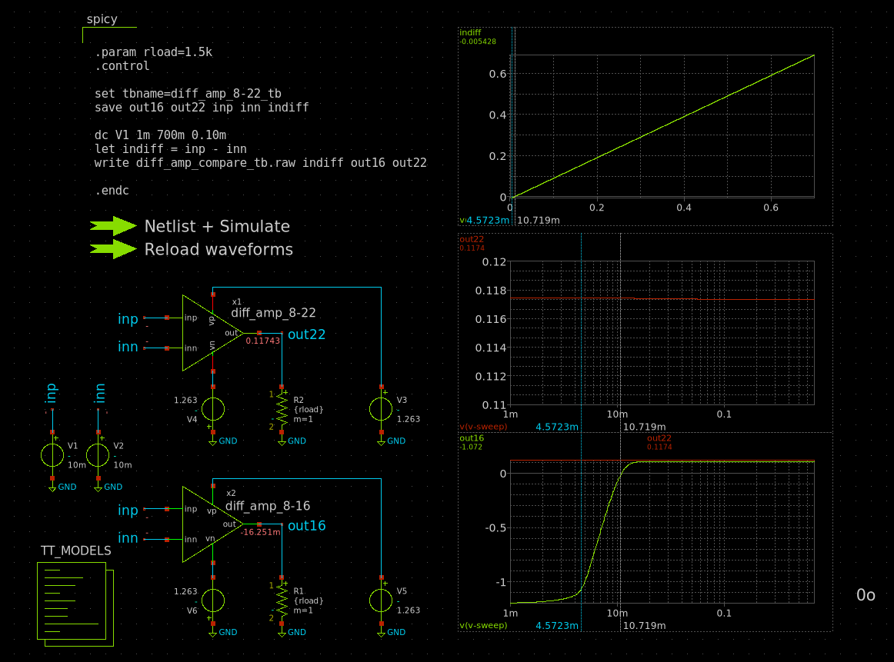
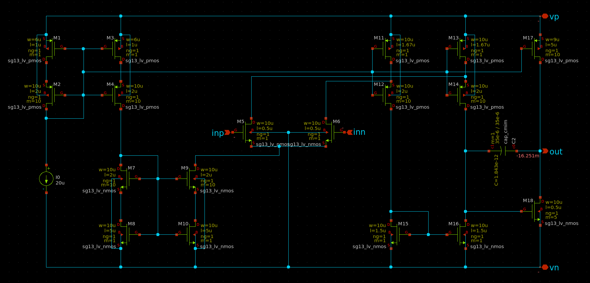
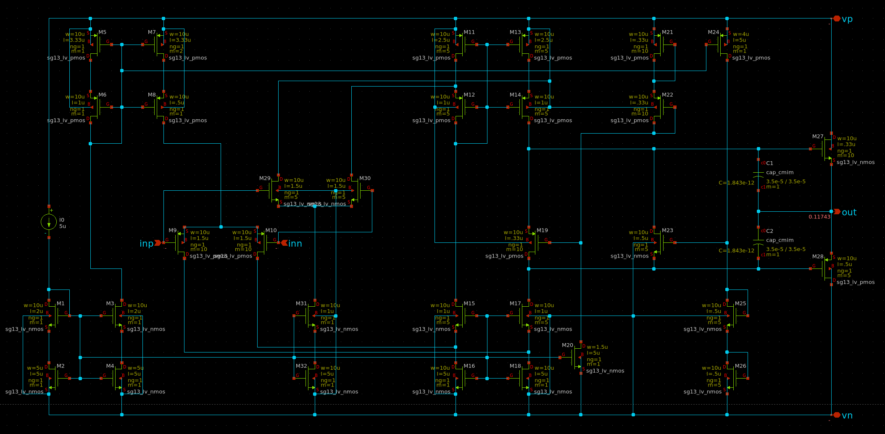
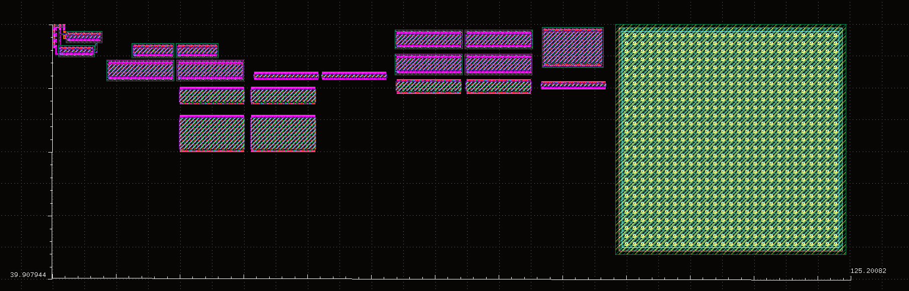
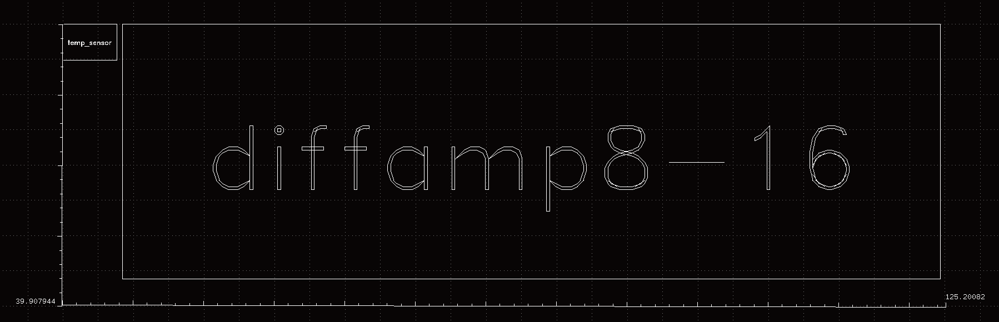

# Design(ing) of a Monolithic Temperature Sensor?

Hey there,

the mess you found resembles my learning curve on working with IHPs BiCMOS/SG13G2 technology node designing a low-bandwidth, moderate resolution(?) monolithic temperature sensor.

The most basic steps are:

1. Converting Temperature to a voltage or current.
2. Amplification of that voltage.
3. Digitizing of the amplified voltage signal.

## Toolchain

Way more stuff than needed but "just works" and ez portable between devices/OSes: [IIC-OSIC-TOOLS](https://github.com/iic-jku/IIC-OSIC-TOOLS.git) by Harald Pretl.

Custom ``.designinit`` from [here](https://gist.github.com/0486ea22c6422ac99e09981821f6f2e3.git) and custom ``xschemrc`` from [here](https://gist.github.com/3af057f8273033688fce2c2d8ffad4ff.git).

# Designs

## Temperature Sensor

### [ptat_nmos_only](designs/sg13g2/practicing/TempSensor/design_data/xschem/ptat_nmos_only.sch)

From [*The ptat sensors in CMOS technology*](https://ieeexplore.ieee.org/document/1558746).

## Amplifier

[diff_amp_compare_tb.sch](TempSensor/design_data/xschem/diff_amp_compare_tb.sch)

Design as shown in fig. 8.16 and fig. 8.22 in Hans Camenzinds Book [*Designing Analog Chips*](http://www.designinganalogchips.com/). Device params to be tuned.

### 8-16

[diff_amp_8-16.sch](TempSensor/design_data/xschem/diff_amp_8-16.sch)

### 8-22

[diff_amp_8-22.sch](TempSensor/design_data/xschem/diff_amp_8-22.sch)

## ADC

$\Sigma \Delta$

# Layout

My humble first layout taken the temperature sensor [ptat_nmos_only](designs/sg13g2/practicing/TempSensor/design_data/xschem/ptat_nmos_only.sch) and [diff_amp_8-16.sch](TempSensor/design_data/xschem/diff_amp_8-16.sch) from above. This is considered WIP. Size at the current state is about **40 x 125 microns**.

### SKY130

Two tested working designs in SKY130 PDK.

* [**[TT]** 4bit SAR ADC](https://github.com/RVCE-DrSSN/tt_um_4Bit_SAR_ADC)
* [**[TT]** 12bit SAR ADC](https://www.tinytapeout.com/runs/tt07/tt_um_rnunes2311_12bit_sar_adc) und [SAR_ADC_12bit](https://github.com/rnunes2311/SAR_ADC_12bit)
    * 
* [**[IEEE]** Low-Power Current-Mode ADC for CMOS Sensor IC](https://ieeexplore.ieee.org/document/1464655)

### 🛋️ Other Ready Stuff

* [**[analog.com]** Measuring Computer Chip Temps with Speed and Accuracy](https://www.analog.com/en/resources/analog-dialogue/articles/measuring-computer-chip-temps-with-speed-and-accuracy.html)
* [**[analog.com]** Silicon Temperature Sensing with Precision — An Autobiographical Look at Measuring Temperature to ±0.1°C](https://www.analog.com/en/resources/technical-articles/silicon-temperature-sensing-with-precision.html)
* [**[Google Doc]** Chip Design Terminology](https://docs.google.com/document/d/1rDN5jw8sh0aTwf1jScn0nP2zy4FWLxC-82M8TL3Lbr4/mobilebasic)